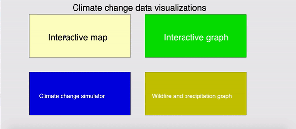
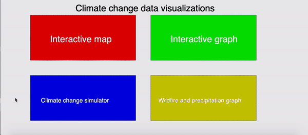

# javascript-interactives
set of interactive javascript codes

Climate change visualzations and widgets:

- Main menu:

- Interactive map:

- Interactive graph:

- Climate change simulator:

- Socially distant mouse following
  - box will follow mouse at fixed distance

- Color changing pen
  - drawing pen will change color depending on position

- Buildings in New York
  - shows relative heights of some buildings in nyc

- Length of train systems
  - shows relative lengths using train track drawings
  
- Glacier graph
  - graph showing glacier loss sourced from online library

- Hover color changing
  - changes color when you hover over the box

- Drawing pad
  - drawing pad with multiple colors

- reading from government spending file
  - reads form and analyzes government spending file.
